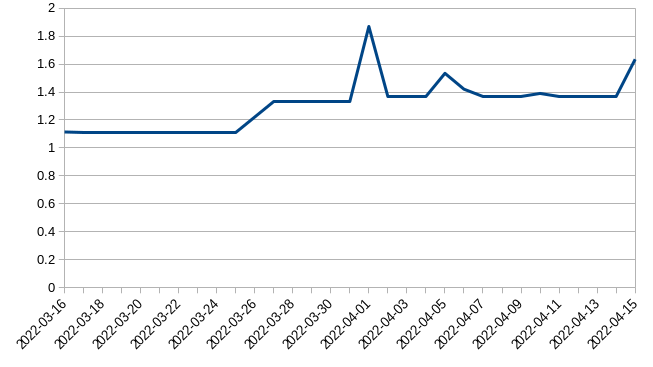

# AWS cost utility 

Get human readable costs data from AWS account.

By default, bring each day cost since a month ago. You can custom the period of fetching the data.

## Installing

Go to the project's root directory and then types:

```
pip install -r requirements.txt
pip install .
```

## Using

In the command line, type:
```
awscosts --profile <your_aws_profile_name>
```


By default, the output is setted to get data costs from a month ago until the current date. But if you want to set a different starting period, do:
```
awscosts --profile <your_aws_profile_name> --start-time 2022-02-16
```

Maybe you want to plot the day-by-day costs in a graph. You can change the data output to csv format, so you can use in your own application as data input or to plot a graph i Libreoffice.

```
awscosts --profile <your_aws_profile_name> --format csv
```



If you want to get costs from a specific service, do:
```
awscosts --profile <your_aws_profile_name> --type <service>
```

Allowed services are:

* ec2
* s3
* workmail
* tax
* cloudwatch
* sns
* route53
* rds
* codecommit
* dynamodb
* ce
* compute
* cloudfront
* efs
* kms

You can get prices from several services at once separated by comma:

```
awscosts --profile <your_aws_profile_name> --type workmail,sns
```

Good to know the meaning of each service (following the results of command: `aws ce get-dimension-values --dimension SERVICE --time-period Start=2022-04-01,End=2022-04-25`):

* ec2: EC2 - Other
* ce: AWS Cost Explorer
* compute: Amazon Elastic Compute Cloud - Compute
* s3: Amazon Simple Storage Service
* workmail: AmazonWorkMail
* tax: Tax
* cloudwatch: AmazonCloudWatch
* sns: Amazon Simple Notification Service
* route53: Amazon Route 53
* rds: Amazon Relational Database Service
* dynamodb: Amazon DynamoDB,
* kms: AWS Key Management Service,
* cloudfront: Amazon CloudFront,
* efs: Amazon Elastic File System

You can at once check all costs for each of above service with the following:

```
awscosts --profile dcscosts --spread-services
```
Then you can see something like this:
```
2022-04-23:
    s3: 0.3582866845
    workmail: 0.4000000032
    tax: 0.0
    cloudwatch: 0.0
    sns: 0.0
    route53: 0.0001528
    rds: 1.0765918608
    codecommit: 0.0
    dynamodb: 0.0
Total in 2022-04-23: 1.8350313485
2022-04-24:
    s3: 0.3591142326
    workmail: 0.4000000032
    tax: 0.0
    cloudwatch: 0.0
    sns: 0.0
    route53: 6.52e-05
    rds: 1.0757114117
    codecommit: 0.0
    dynamodb: 0.0
Total in 2022-04-24: 1.8348908475
```
**BUT CAUTION**: Several api calls to AWS may be done at once with the parameter `--spread-services`. At the time of this writting, AWS charges US$ 0.01 for each api call. So use this parameter with moderation, or you will ended up with unexpected charge rise.

**ANOTHER WARNING**: Still this way not all services that consumes money are considered. Run this command without `--spread-services` and probably you still see some difference. The consumption sum may still be underestimated compared to the output that considers all costs from a period.
